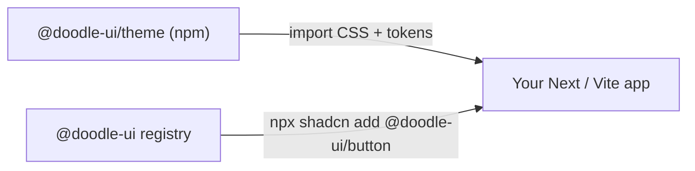

# Doodle UI

A childish, hand-drawn theme for [shadcn/ui](https://ui.shadcn.com) — wobbly blob corners, the **Neucha** and **Cabin Sketch** fonts, chunky ink outlines, and full **light + dark** support. Every shadcn/ui component, restyled.

The visual DNA comes from the original [Sooshial Medea](https://github.com/KareemGhorab/Sooshial-Medea) project.



Doodle UI ships in two parts:

| Piece | What it is |
|-------|-----------|
| [`@doodle-ui/theme`](./packages/theme) | An npm package with the shared design tokens: light/dark CSS variables, fonts, and the signature blob border-radius system. |
| `@doodle-ui` registry | A [shadcn registry](https://ui.shadcn.com/docs/registry) of the full component set, restyled with the doodle look. You install components with the shadcn CLI and own the source. |

## Quick start

### 1. Install the theme

```bash
npm i @doodle-ui/theme
```

Import it in your global stylesheet (Tailwind CSS v4):

```css
@import "@doodle-ui/theme/fonts.css";  /* first, so the font @import is valid */
@import "tailwindcss";
@import "@doodle-ui/theme/styles.css";

@custom-variant dark (&:is(.dark *));
```

### 2. Add the registry

```bash
npx shadcn@latest registry add @doodle-ui=https://doodle-ui.vercel.app/r/{name}.json
```

Or add it manually in your `components.json`:

```json
{
  "registries": {
    "@doodle-ui": "https://doodle-ui.vercel.app/r/{name}.json"
  }
}
```

### 3. Add components

```bash
npx shadcn@latest add @doodle-ui/doodle          # base style (light + dark tokens)
npx shadcn@latest add @doodle-ui/button @doodle-ui/card @doodle-ui/input
```

### Install straight from GitHub (no registry host)

This repo is also a [GitHub registry](https://ui.shadcn.com/docs/changelog/2026-06-github-registries), so you can install without any hosted URL:

```bash
npx shadcn@latest add KareemGhorab/doodle-ui/button
```

## Dark mode

Tokens use the standard shadcn `.dark` class strategy. Toggle with [`next-themes`](https://github.com/pacocoursey/next-themes) or by putting `dark` on `<html>`:

```tsx
import { ThemeProvider } from "next-themes";

<ThemeProvider attribute="class" defaultTheme="light" enableSystem>
  {children}
</ThemeProvider>;
```

## The doodle look

- **Fonts** — Neucha (body) + Cabin Sketch (display headings)
- **Palette** — white / near-black ink in light, chalk-white on slate in dark
- **Blob radii** — organic, per-surface corners via `--doodle-radius-*` tokens and `.doodle-radius-*` utilities:

| Token | Surfaces |
|-------|----------|
| `button` | buttons, badges, toggles, pagination |
| `input` | inputs, textarea, select, calendar |
| `card` | cards, alerts, tables, accordions |
| `modal` | dialog, sheet, drawer |
| `popover` | popover, dropdown, menus, tooltip, command |
| `nav` | tabs, navigation menu, breadcrumb |
| `media` / `avatar` | media frames, avatars |
| `pill` | progress, slider, scroll area |

## Repo layout

```
doodle-ui/
  apps/www/            # docs + live gallery; serves the built registry at /r/*.json
  packages/theme/      # @doodle-ui/theme (published to npm)
  registry/doodle/     # forked, restyled shadcn component source (source of truth)
  registry.json        # registry catalog (generated by scripts/build-registry.mjs)
  scripts/             # doodlefy (restyle) + build-registry generators
```

## Development

```bash
pnpm install
pnpm dev                # run the docs site
pnpm registry:build     # regenerate apps/www/public/r/*.json
node scripts/build-registry.mjs   # regenerate registry.json after adding components
node scripts/doodlefy.mjs         # re-apply the doodle restyle to registry components
```

### Deploy the registry (Vercel)

The repo includes [`vercel.json`](./vercel.json). Import the repo into Vercel with the project root at the repository root; the build runs `registry:build` then `next build`, and the JSON is served from `apps/www/public/r`. Update the registry URL in this README and in `registry.json`'s `homepage` to match your deployment.

### Publish the theme

```bash
cd packages/theme
npm publish            # requires npm auth and the @doodle-ui scope
```

## License

MIT
